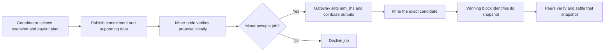

# Template-work evidence and replicated pool settlement on Knots

The [hash-only version 2 profile](sharepool-hash-only.md) specifies the current
off-block snapshot format and its separately enabled native regtest validation.

Status: broader protocol proposal, with a newer
[native enforcement profile](sharepool-native-enforcement.md) implementing a
bounded subset on explicitly enabled regtest nodes. That profile adds native
snapshot/share/payout checks, parent-anchored replay protection and a miner gate;
it is not a production release or public-network activation. Earlier model
results remain in the [test report](sharepool-test-report.md).
The earlier [permissionless checkpoint reference](sharepool-pow-ledger.md) adds
PoW ordering, checkpoint-age eligibility, quota renewal by empty checkpoints,
and provisional settlement reorganization. It supersedes coordinator seals as
the proposed accounting-ordering direction. The earlier
[continuous protocol reference](sharepool-live-protocol.md) remains an executable
signed-receipt baseline with a separate gateway and HTTP path.
The [hardware integration report](sharepool-hardware-and-production.md) adds a
measured Testnet4 Goldshell run and passive native settlement observation, while
explicitly separating those components from integrated consensus enforcement.

Base: `bitcoinknots/bitcoin`, tag `v29.4.1.knots20260508`, commit
`8c85b1585dac23f964e2dd32045624de7f02aa58`.

## Objective: miner control and evidence of work on different templates

The intended purpose is to establish that miners are working on templates
distinguished by each DATUM node's coinbase tag, and to require that evidence
across pools in support of miner control. Settlement
commitments are the evidence transport and accounting mechanism for that purpose.
The desired enforcement scope is every accepted block on the proposed fork,
regardless of its declared pool. Each registered payout script has a configurable
absolute budget of verified share work over an agreed origin epoch, initially
scoped to each pool. All tags and miner IDs paying that script share its allowance.
Registered miners use distinct tags, and winning coinbase
payments must match the referenced registry and accounting state. The measurement
window and broader quota rules remain to be specified. The separate native
regtest profile defines a three-block share-age rule and exact payouts, without
activating the broader absolute work-budget proposal.

The permissionless reference now selects checkpoint-height epochs and explicit
ancestor/age eligibility. These are work quotas per ledger epoch, not physical
TH/s over a verified time interval. Its synthetic candidate reward history follows
checkpoint forks; integrating that history with Bitcoin's actual block chain
remains unspecified. The rules below describe the broader proposal; the linked
reference document defines the current executable subset and its limits.

Different coinbase tags do make the full templates different, even when every
non-coinbase transaction is identical. The protocol's primary evidence therefore
retains and checks the tag; it must not discard tag differences merely because
the transaction selections match. The user is asking to track work by this node
identifier, not to require every node to select different non-coinbase transactions.

DATUM exposes a configurable secondary coinbase tag for pooled mining. Its
[example configuration](https://github.com/OCEAN-xyz/datum_gateway/blob/master/doc/example_datum_gateway_config.json)
uses a generic example value, so distinct values are not guaranteed simply by
running DATUM. A protocol using tags as identifiers must define their canonical
encoding, identity binding, and collision/duplicate handling.

There is a fundamental distinction between these claims:

| Claim | What this evidence can establish |
| --- | --- |
| Work was produced against a specific template | Valid share PoW, correctly bound to the template's transactions and job context, provides evidence of work on that template. |
| Published work covers templates with different coinbase tags | Authenticate each actual coinbase against its share header, extract its tag, and account for verified work under that identifier. Different transaction selections are not required. |
| Published work covers different transaction selections | An optional, separate metric can compare authenticated non-coinbase transaction sets. It is not the uniqueness criterion requested here. |
| Independent miners selected those transactions or used DATUM | Neither PoW nor a Merkle commitment establishes who made that choice or which software/protocol was used. |

## Absolute work budget per registered payout script

For each pool and an explicitly identified origin epoch, let `W_p` be the sum of
credited work for unique eligible shares assigned to registered payout script
`p`. The budget key is `(pool_id, origin_epoch, payout_script_bytes)`, using the
exact script bytes authorized by each share's original job registry. The ruleset
commits `budget_basis = "payout-script"` and supplies a positive nominal window
duration and configured rate budget:

```text
W_p = sum(floor(2^256 / (approved_share_target_i + 1)))
for every payout script p: W_p <= maximum_hashes_per_second * window_seconds
```

Equality at the budget is permitted. Use exact integer arithmetic without rounding
down an over-budget total. A rate budget of 5 TH/s and a 600-second window would
allow 3,000,000,000,000,000 work units per pool/payout script; these are examples,
not activated parameters. Other scripts' work does not change that allowance.
There is no percentage limit or fixed minimum count of recipients or templates.
Empty evidence does not establish zero hashrate; the continuous reference has an
explicit finder-payout bootstrap for jobs with no unpaid claims. This budget is
per pool, not global across pools.

The coinbase tag identifies the registered miner and its template. It does not
identify an independent allowance: every miner ID and tag pointing to the same
payout script contributes to one budget. Nonce, extranonce, timestamp, transaction
updates, or a refreshed settlement root cannot reset that total. A claim keeps
the payout script from its historical job registry even after a payout update;
past credit does not move to the new destination. The exact job identifier still
validates the template and its permitted mutations.

Credit each unique share according to its protocol-approved, predeclared target
`T`, for example using `floor(2^256 / (T + 1))` integer work units. This follows
the form of [Knots' work calculation](https://github.com/bitcoinknots/bitcoin/blob/v29.4.1.knots20260508/src/chain.cpp).
Validate the actual PoW, target assignment, attribution, and eligibility first.
Do not weight by the achieved lucky hash, accept a target chosen after finding a
share, or count a share twice. Raw share counts are sufficient only when every
share has the same credited work. Credited work measures the published proof
sample; it is not an exact measurement of all hashes physically performed.

A coordinator-selected subset can pass while the pool's full share history fails.
To claim a cap on each payout script's total verified work, all nodes need the same objective
inclusion/cutoff rules and an auditable accepted-share history, rather than a
coordinator choosing convenient records. Until then the check only bounds work in
the supplied snapshot. Discarding over-budget shares would hide the behavior being
measured. Ordinary share luck can also exceed a work budget even when physical
hashrate is unchanged.

Local share-arrival times differ between nodes and cannot determine block validity.
The protocol needs a common window and eligibility cutoff established before the
job is mined. A chain epoch with a declared nominal duration gives a deterministic
work quota, not proof of elapsed wall-clock time or an instantaneous hardware rate.
Supporting-share generation must not depend circularly on the snapshot committed
by those shares themselves.

The coordinator includes the snapshot's commitment before mining, and enforcing
nodes check that particular snapshot under the shared rules. The continuous
reference's `credit-and-stop` policy retains accepted in-flight work and rejects
new jobs whose own committed prefix has exhausted their payout script's budget.
The honest gateway uses its latest verified prefix. Eligible older-prefix jobs
can still win, and Engine validation does not impose global latest-prefix
freshness, even for newly signed jobs. This is not a hard maximum on all accepted
work. The stricter fixed-snapshot checker and the continuous policy must not be
confused.

The [rule proposal](sharepool-rule-proposal.md) specifies the work formula, payout
aggregation, time/withholding limitations, different tagged jobs for registered miners,
and exact registry-version binding for payouts. The registry's accepted history
and window still require production consensus integration. Authenticated reference
registries and immutable jobs are now implemented in the
[continuous protocol](sharepool-live-protocol.md).

## What template-work evidence establishes

A pool can centrally create multiple templates with different tags, present
multiple miner identities, and obtain precisely the same share evidence as
independent miners. Independent DATUM miners with similar mempools may choose
identical transactions while their distinct tags still distinguish their templates.
Public keys or coordinator signatures establish control of keys, not independent
ownership or transaction-selection authority. Requiring a DATUM-compatible proof
format therefore cannot enforce use of DATUM software or genuine miner autonomy.

For observable template-work evidence, each record would provide the share header,
the data authenticating its transactions, its main-chain parent and job context,
and the applicable share target. Nodes must verify those bindings and actual work;
an unsigned list of template hashes or a coordinator's hashrate assertion is not
sufficient. A public share verifier for this tag's hidden-key mode is still needed
if that mode is retained.

For tag attribution, a verification record needs the actual serialized coinbase
and a valid transaction-Merkle proof or full block data binding it to the share's
header. A coordinator-supplied label next to a share is insufficient. The actual
tag must have been committed before hashing. A plain tag can be copied; an optional
node public-key identifier in the coinbase plus a signed job commitment can
authenticate approval by that key holder. This authenticates a key, not a distinct
operator, exclusive hardware, or execution of DATUM software. Full template
validation still needs the other required transaction and chain-state data.

Keep the following identifiers separate:

- The registered payout script, for aggregating the budget across all miners and
  tags assigned to that destination within a pool and origin epoch.
- The declared node tag or authenticated public-key identifier extracted from
  the committed coinbase, for auditing the template's registered miner attribution.
- An exact job/template identifier with precisely defined permitted header and
  coinbase mutations, for validating the submitted work.
- An optional comparison fingerprint of the selected non-coinbase transaction set, with a
  versioned canonical encoding, count, and hash domain. For this metric, sorting
  transaction identifiers prevents mere reordering from appearing as a different
  selection. Nonces, extranonces, coinbase tags, payout changes, and the settlement
  root itself do not represent different transaction selections. This optional
  comparison does not erase tag differences from the primary work evidence.

Recompute the comparison fingerprint from transactions authenticated by the actual
share header; do not hash a normalized substitute header as evidence of mining
work. Full template validity is checked in its proper chain context before using
the derived metric. Excluding coinbase differences from the comparison does not
exclude coinbase validity or payouts from full verification.

Any consensus requirement would need an objective parent-block window, minimum
share work, replay prevention, resource bounds, and a historical data-availability
scheme. The winning template must commit to previously available evidence; it
cannot commit to every share that will arrive before the eventual block is found.
Pool labels are not a reliable registry of independently controlled organizations.

A separate requirement for a minimum number of different transaction sets could be satisfied by a
central pool adding trivial transactions or dropping transactions from several
variants. It could also penalize honest miners, low-transaction periods, or small
participants. That requirement is not part of the user's tag-based definition of
template uniqueness. Creating additional tags or keys does not establish independent operators. The
evidence can support auditing of disclosed work across templates with distinct
tags; it must not be described as a cryptographic proof of
decentralized control or as enforcement of DATUM use across all pools.

The direct guarantee for a participating miner remains local: its own node and
gateway choose or approve the transaction selection and verify the exact job
sent to its hardware. Extending that guarantee to a remote observer requires
additional assumptions about identity and control that the proposed commitments
do not supply.

## Feasibility

Yes. The pool coordinator proposes the settlement snapshot and supplies its
commitment for inclusion in each mining template **before hashing**. Nodes exchange
templates and shares, replicate accounting data, and independently check the
coordinator's proposal. Miners choose whether to accept the job.

The coordinator supplies the ordering and snapshot-selection role. A permissionless
sharechain such as [P2Pool](https://github.com/p2pool/p2pool) is therefore an
alternative architecture, not a prerequisite for this design. The coordinator's
selection remains auditable and subject to miner acceptance; it is not evidence
that every submitted share has been included.

This exact tag uses a version-2 BLAKE2b header at its configured activation.
`src/primitives/block.h` serializes the 256-bit `m_mm_rhs` field.
`CBlockHeader::GetHash()` in `src/primitives/block.cpp` includes that field in the
tagged merge-mining hook before calculating PoW. This is a usable commitment
location, not a sidechain database or an existing pool-settlement protocol.
Compatibility here means compatibility with this exact Knots chain and its rules;
it does not imply compatibility with SHA256d-only software or miners.

## Coordinator supplies the commitment before mining

The settlement root must be fixed **before** miners hash a job. Replacing it after
finding a block changes the hash; the old solution provides no assurance that the
modified block meets the target. Coinbase payouts must also be fixed before mining.

The coordinator publishes an immutable snapshot and commitment for a particular
job. It can continue collecting shares and issue newer jobs with updated snapshots.
A winning block settles **the snapshot in the winning job**, which may be older
than the coordinator's latest proposal. Nodes must retain that snapshot and cannot
replace it with their current round data at settlement time.

Define which jobs remain eligible, share cutoffs, how omitted or later shares are
credited in future jobs, and what closes a round. These are published pool rules,
not decisions based on whichever records each peer happened to receive first.
No peer can establish that a privately withheld share does not exist. A newer job
does not retroactively change an earlier job's commitment or the base-chain
validity of a solution to it.

The winning share itself cannot be an ordinary leaf in the root its own PoW
commits to: that would introduce a circular dependency. Use a predecessor state,
with any finder reward specified in the candidate coinbase before mining, or
credit the winning contribution through a later, explicitly defined transition.

## Proposed participant flow



The first development stages can use an isolated peer service and explicit pool
namespaces for testing. The intended network-wide requirement would need a
separately specified and activated consensus rule for every accepted fork block.
Pool participation, template selection, and additional relay preferences remain
local choices. This branch currently leaves upstream block validity unchanged.

With DATUM specifically, the gateway obtains a template from the miner's local
node and the pool supplies reward splits; the pool does not supply the transaction
template. This extension would add the settlement commitment and supporting
accounting data to the pool-to-gateway exchange. The gateway verifies them and
incorporates them into its locally constructed job before distributing work to
mining hardware. A conventional pool could instead supply the complete template.
These existing roles are described in the
[DATUM Gateway documentation](https://github.com/OCEAN-xyz/datum_gateway#datum-protocol).
This proposal does not claim existing DATUM supports `m_mm_rhs` or this tag's
BLAKE2b header; compatibility requires implementation and testing.

## How miners refuse a commitment

Enforce the decision in software controlled by the miner: a validating node or
accounting verifier feeds a job-admission check in the miner's gateway. Mining
hardware only receives jobs that pass this check. A miner using only a remote
pool connection without such a verifier cannot independently audit the records
behind an opaque commitment.

Evaluate proposals in two stages:

1. **Verify the proposal.** Authenticate the coordinator, fetch the required
   records, verify their work and eligibility, reject duplicate credit, recompute
   the snapshot root and payout calculation, and check chain/round context.
   Missing records leave the proposal pending; they do not establish misconduct.
2. **Apply miner policy.** Check locally chosen pool/coordinator allowlists,
   supported accounting rules, fee limits, required payout terms, and any
   acknowledged-share inclusion requirements. A technically consistent proposal
   can still fail these preferences.

The proposed admission flow is:

```text
proposal arrives
  data incomplete       -> request data; do not issue this job
  verification fails    -> reject this proposal with a reason
  local policy declines -> decline this proposal
  verification + policy pass
                        -> construct candidate with approved root and payouts
                        -> verify exact final candidate and allowed mutations
                        -> issue work to the miner's hardware
```

The final check prevents a coordinator update, template rebuild, or changed payout
from silently replacing already approved data. Approval is attached to the exact
proposal/job context and must be reconsidered when that context changes. Policy
settings are versioned locally and never supplied as authoritative instructions
by the coordinator.

Refusal does not require the coordinator's permission or even a rejection message:
the gateway withholds the miner's hashrate from that proposal. A future protocol
may send an authenticated response containing the proposal ID, a reason such as
`root-mismatch`, `payout-mismatch`, or `policy-declined`, and bounded supporting
evidence when appropriate. These are proposed messages, not existing DATUM RPCs.

After refusal, the gateway may continue an older **still eligible and locally
approved** job, request a corrected proposal, or use another configured coordinator.
Solo mining is a separate explicit miner preference with its own payout template.
If there is no acceptable job, pause work or use the gateway's supported worker
disconnect/failover behavior. Configure hardware backup pools to obey the same
approved-pool policy. Never silently accept a rejected commitment merely
to keep hardware busy. If an active job is withdrawn locally, replace/stop it using
the supported worker protocol; in-flight work and delayed solutions may still arrive.

A miner can construct a different commitment before mining, but it becomes a new
job. The original pool need not credit its shares unless its protocol accepts that
variant. Removing a disliked pool from an aggregate similarly requires a new root
and, where affected, a new payout plan and coordinator agreement for pooled credit.

This refuses participation in a job, not the existence of another miner's block.
Under the optional-overlay model, an otherwise valid base-chain block remains
valid even when its commitment fails local preferences. Rejecting chain blocks
requires the separate, commonly enforced consensus rules described below.

## Template and share validation

Templates advertise a content identifier and enough retrievable transaction and
coinbase data for local validation against the referenced chain state. Template
identity must define permitted nonce, extranonce, and time mutations precisely.
The upstream `getblocktemplate` implementation requires clients to declare
`blake2b` support when applicable; this is not a drop-in SHA256 Stratum integration.

Each share must bind the protocol version, base-chain identity, pool identity,
previous main block, coordinator-selected predecessor state, template, payout
destination, and protocol-approved target **in the mined commitment**. An attached miner name or
signature alone cannot prevent relabeling work. Define which fields are committed
before mining and which are derived afterward to avoid another self-reference.

Before acceptance, a node verifies the share's encoding and resource bounds,
permitted target and credited work, actual PoW, predecessor references, template
and transaction validity, payout commitment, attribution, and duplicate identity.
Weight accounting by verified work, not the number of connections, pool names, or
arbitrarily easy shares. Miner submissions at low local difficulty need not all be
global accounting shares; a higher protocol difficulty can bound network load.

## Coordinator manifests and multiple pools

The coordinator selects a concrete dataset; validating nodes reconstruct that
proposal instead of requiring equality with their local share inventories.
Gossip supports replication and auditing. It does not certify completeness.
Signed coordinator receipts for accepted shares can provide evidence when an
acknowledged share is omitted contrary to the published inclusion policy. They
cannot prove that every submission was acknowledged or disclosed.

A proposed settlement manifest identifies:

- Protocol/ruleset and base-chain identity, pool and coordinator identity.
- Previous main block, round identifier, predecessor settlement, and proposal sequence.
- Selected-share Merkle root, record count, and the applicable cutoff/eligibility rule.
- Payout specification and the data needed to verify its calculation for the job.

Bind this metadata into the commitment using a versioned canonical encoding.
Authenticate the proposal, for example with a coordinator signature over its
commitment. Bind the final job identifier to the commitment and the exact allowed
template mutations. Avoid a circular definition in which a template identifier
includes the same commitment that depends on that identifier. The signature proves
authorship, not correctness or payment. Exact encoding and authentication remain
to be specified; the synthetic experiment is not a manifest implementation.

Two different signed proposals at the same logical sequence can be evidence of
coordinator equivocation. Legitimate newer snapshots or template-specific payout
variants must have distinct identifiers. Peers can preserve and relay conflict
evidence; a conflict does not automatically establish a base-chain invalidity rule.

For commitments spanning multiple pools, aggregate a canonical list of
`(pool_id, proposal_id, settlement_root)` entries. The proposing coordinator names
the included pools and miners validate each referenced dataset they are required
to audit before accepting that aggregate. Committing another pool's root does not
authorize spending its funds or settle balances absent agreed cross-pool rules.
No global vote is required merely to mine an explicitly selected aggregate, but
claims that it includes every eligible pool still need a defined eligibility policy.

Each job names an immutable predecessor snapshot. Record eligible shares in a
canonical format and order, reject duplicates, distinguish leaf and internal
hash domains, bind the item count, and bind network, pool, round, and ruleset in
the enclosing commitment. Specify hash byte order when mapping it to `m_mm_rhs`.
If other merge-mined applications also use this field, define a namespaced
aggregation format rather than overwriting their commitments.

On receipt of a winning block, peers obtain its referenced data and validate that
snapshot, not equality with their current inventories. Missing data means the
overlay state is pending verification. A Merkle proof establishes inclusion;
it does not establish share validity, completeness, or data availability.

## Payment and settlement

For a first implementation, the coordinator calculates direct coinbase outputs
from eligible work and participants independently recompute the allocation before
contributing work. Bind any template-dependent subsidy and fees correctly. Define
fees, payout rounding, dust handling, finder reward, and payout-output limits.
Direct coinbase outputs pay the included recipients if the block remains in the
chain, subject to coinbase maturity. They do not make upstream nodes enforce the
pool's fairness rules.

A Merkle root of account balances alone does not transfer coins or allow claims.
If settlement means balances instead of direct outputs, custody and withdrawals
require an additional explicit design.

Persist verified shares, templates or retrievable references, snapshot records,
block associations, and state-transition undo records. Closing a round must be
atomic and idempotent. Retain issued snapshots while their jobs can still produce
eligible solutions. Parent-chain reorganizations and any defined accounting-history
rollback must undo affected settlement. Do not treat the first block announcement
as irreversible finality. Retention and pruning must preserve whatever historical validation a
new participant is expected to perform.

## This release's hidden XOR key

`src/primitives/block.cpp` describes a pooling miner knowing only a commitment to
`m_xor_key` until a block is found. The final hash also depends on the mask derived
from that key. Publishing full headers containing the key to all peers makes the
key public and gives up that concealment's anti-withholding property.

A simple public-validation prototype can use a zero/public key. Preserving the
hidden-key property can assign key custody to the coordinator, but independent
share verification still needs a dedicated public partial-work verifier and an
explicit key-release and availability protocol. Do not claim ordinary
full-header validation preserves the secret-key protection. The accompanying
experiment uses a zero key and does not implement such a verifier.

## Optional overlay versus mandatory chain rules

For an optional overlay, miners may decline a job or peer based on their local
checks. A base-chain-valid block remains valid even when its pool data is missing
or disagrees with a participant's preferred share history.

Requiring every chain block to include a correct pool settlement introduces new
consensus rules. All enforcing nodes, not only miners, need deterministic checks,
an activation mechanism, and a way to obtain every required validation input.
Never use local arrival order, local peer votes, or a missing local share as a
permanent block-invalidity rule. Unilateral deployment can split the chain.
Adding a restriction is not automatically a hard fork relative to this tag;
classification depends on the final rules and compatibility.

The intended scope is mandatory evidence across pools on the proposed fork.
However, only observable proof properties can be consensus rules; DATUM use and
independence of template selection are not proved by those properties. The exact
enforceable requirement for the broader proposal remains open. The local branch
now provides explicitly enabled regtest-only rules for the narrower
[native profile](sharepool-native-enforcement.md); public-network activation is
not supported.

## Implementation boundary and next work

The earlier [experiments](../contrib/sharepool/README.md) include upstream
header-hash checks, exact integer work accounting, synthetic tagged share proofs,
canonical snapshot inclusions, and a multi-node settlement model with payout
checks, delayed-data recovery, reorg accounting, and restart replay. Two actual
stock Knots processes were also tested in isolated regtest through loopback RPC.
They accepted arbitrary `m_mm_rhs` roots without snapshots, demonstrating that
stock validation does not enforce this proposal. The model's settlement rules
are not integrated into Knots as that model. The new native profile has its own
wire rules and actual native enforcement. See the [earlier test report](sharepool-test-report.md)
for measured results, disagreement behavior, and limitations.

The model deliberately selects one pool, a current-parent share window, a fixed
toy reward, zero XOR keys, and the coordinator's disclosed share set. These are
test assumptions, not settled production rules. Supporting shares use separate
zero-payout evidence templates; eligibility as actual settlement-bearing reward
jobs remains unproved. A disclosed snapshot can omit extra work, so it cannot
establish the pool's complete work history. Model balances are provisional
accounting, not spendable payments. The current model applies a configurable
absolute work budget using a nominal duration; the test report records that
configuration. The authenticated registry and live update path now have a separate
[executable reference implementation](sharepool-live-protocol.md).

The coordinator's role, pre-mining commitment timing, intended enforcement
scope, and absolute work-budget objective are specified above. The observable objective is verified work attributed
to registered payout scripts through distinct tagged coinbases; independent operator control
is a separate property that these proofs do not establish. Next specify the
measurement window, complete eligible-share history, initial accounting state, and
production reward-job eligibility. Extend the reference's authenticated manifests
and synthetic reward jobs to full transaction templates and actual mining-protocol
messages, and replace loopback replication with a production peer transport.
Relevant integration points are `src/node/miner.cpp`, `src/rpc/mining.cpp`, the
mining interfaces, and an isolated share-state store. Base-chain validation must
only change once the exact evidence rule and its activation have been specified.

Required integration scenarios include delayed shares, duplicate/replayed work,
invalid templates, false payout attribution, unavailable snapshots, conflicting
coordinator proposals, newer snapshots overtaking still-eligible jobs, two winners,
peer partitions, main-chain reorganizations, crash recovery,
bounded storage, and interoperability with unchanged nodes in overlay mode.
Template-evidence tests must also cover distinct tags with identical transaction
selections, forged labels, copied tags, invalid coinbase-Merkle proofs, nonce-only
differences, reordered transactions, centrally generated variants, invented
miner identities, stale or replayed work, and low-transaction periods.
