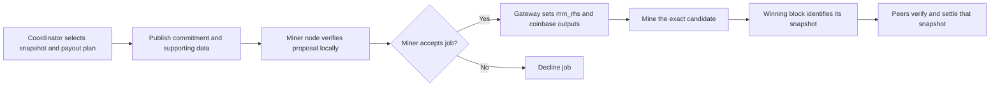

# Replicated mining pools on Knots: feasibility and protocol draft

Status: design only, with a separate synthetic commitment experiment. No mining
network, payout system, new RPC, or consensus change is implemented by this draft.

Base: `bitcoinknots/bitcoin`, tag `v29.4.1.knots20260508`, commit
`8c85b1585dac23f964e2dd32045624de7f02aa58`. Local branch:
`sharepool/design-prototype`. This checkout has not been published as a GitHub fork.

## Feasibility

Yes. The pool coordinator proposes the settlement snapshot and supplies its
commitment for inclusion in each mining template **before hashing**. Nodes exchange
templates and shares, replicate accounting data, and independently check the
coordinator's proposal. Miners choose whether to accept the job.

The coordinator supplies the ordering and snapshot-selection role. A permissionless
sharechain such as [P2Pool](https://github.com/p2pool/p2pool) is therefore an
alternative architecture, not a prerequisite for this design. The coordinator's
selection remains auditable and subject to miner acceptance; it is not evidence
that every submitted share has been included.

This exact tag uses a version-2 BLAKE2b header at its configured activation.
`src/primitives/block.h` serializes the 256-bit `m_mm_rhs` field.
`CBlockHeader::GetHash()` in `src/primitives/block.cpp` includes that field in the
tagged merge-mining hook before calculating PoW. This is a usable commitment
location, not a sidechain database or an existing pool-settlement protocol.
Compatibility here means compatibility with this exact Knots chain and its rules;
it does not imply compatibility with SHA256d-only software or miners.

## Coordinator supplies the commitment before mining

The settlement root must be fixed **before** miners hash a job. Replacing it after
finding a block changes the hash; the old solution provides no assurance that the
modified block meets the target. Coinbase payouts must also be fixed before mining.

The coordinator publishes an immutable snapshot and commitment for a particular
job. It can continue collecting shares and issue newer jobs with updated snapshots.
A winning block settles **the snapshot in the winning job**, which may be older
than the coordinator's latest proposal. Nodes must retain that snapshot and cannot
replace it with their current round data at settlement time.

Define which jobs remain eligible, share cutoffs, how omitted or later shares are
credited in future jobs, and what closes a round. These are published pool rules,
not decisions based on whichever records each peer happened to receive first.
No peer can establish that a privately withheld share does not exist. A newer job
does not retroactively change an earlier job's commitment or the base-chain
validity of a solution to it.

The winning share itself cannot be an ordinary leaf in the root its own PoW
commits to: that would introduce a circular dependency. Use a predecessor state,
with any finder reward specified in the candidate coinbase before mining, or
credit the winning contribution through a later, explicitly defined transition.

## Proposed participant flow



Start with an **opt-in overlay** whose participants run validating Knots nodes.
Use a separate peer service and an explicit pool namespace. Pool participation,
template selection, and relay policy are local choices. Base-chain block validity
continues to follow the upstream rules.

With DATUM specifically, the gateway obtains a template from the miner's local
node and the pool supplies reward splits; the pool does not supply the transaction
template. This extension would add the settlement commitment and supporting
accounting data to the pool-to-gateway exchange. The gateway verifies them and
incorporates them into its locally constructed job before distributing work to
mining hardware. A conventional pool could instead supply the complete template.
These existing roles are described in the
[DATUM Gateway documentation](https://github.com/OCEAN-xyz/datum_gateway#datum-protocol).
This proposal does not claim existing DATUM supports `m_mm_rhs` or this tag's
BLAKE2b header; compatibility requires implementation and testing.

## How miners refuse a commitment

Enforce the decision in software controlled by the miner: a validating node or
accounting verifier feeds a job-admission check in the miner's gateway. Mining
hardware only receives jobs that pass this check. A miner using only a remote
pool connection without such a verifier cannot independently audit the records
behind an opaque commitment.

Evaluate proposals in two stages:

1. **Verify the proposal.** Authenticate the coordinator, fetch the required
   records, verify their work and eligibility, reject duplicate credit, recompute
   the snapshot root and payout calculation, and check chain/round context.
   Missing records leave the proposal pending; they do not establish misconduct.
2. **Apply miner policy.** Check locally chosen pool/coordinator allowlists,
   supported accounting rules, fee limits, required payout terms, and any
   acknowledged-share inclusion requirements. A technically consistent proposal
   can still fail these preferences.

The proposed admission flow is:

```text
proposal arrives
  data incomplete       -> request data; do not issue this job
  verification fails    -> reject this proposal with a reason
  local policy declines -> decline this proposal
  verification + policy pass
                        -> construct candidate with approved root and payouts
                        -> verify exact final candidate and allowed mutations
                        -> issue work to the miner's hardware
```

The final check prevents a coordinator update, template rebuild, or changed payout
from silently replacing already approved data. Approval is attached to the exact
proposal/job context and must be reconsidered when that context changes. Policy
settings are versioned locally and never supplied as authoritative instructions
by the coordinator.

Refusal does not require the coordinator's permission or even a rejection message:
the gateway withholds the miner's hashrate from that proposal. A future protocol
may send an authenticated response containing the proposal ID, a reason such as
`root-mismatch`, `payout-mismatch`, or `policy-declined`, and bounded supporting
evidence when appropriate. These are proposed messages, not existing DATUM RPCs.

After refusal, the gateway may continue an older **still eligible and locally
approved** job, request a corrected proposal, or use another configured coordinator.
Solo mining is a separate explicit miner preference with its own payout template.
If there is no acceptable job, pause work or use the gateway's supported worker
disconnect/failover behavior. Configure hardware backup pools to obey the same
approved-pool policy. Never silently accept a rejected commitment merely
to keep hardware busy. If an active job is withdrawn locally, replace/stop it using
the supported worker protocol; in-flight work and delayed solutions may still arrive.

A miner can construct a different commitment before mining, but it becomes a new
job. The original pool need not credit its shares unless its protocol accepts that
variant. Removing a disliked pool from an aggregate similarly requires a new root
and, where affected, a new payout plan and coordinator agreement for pooled credit.

This refuses participation in a job, not the existence of another miner's block.
Under the optional-overlay model, an otherwise valid base-chain block remains
valid even when its commitment fails local preferences. Rejecting chain blocks
requires the separate, commonly enforced consensus rules described below.

## Template and share validation

Templates advertise a content identifier and enough retrievable transaction and
coinbase data for local validation against the referenced chain state. Template
identity must define permitted nonce, extranonce, and time mutations precisely.
The upstream `getblocktemplate` implementation requires clients to declare
`blake2b` support when applicable; this is not a drop-in SHA256 Stratum integration.

Each share must bind the protocol version, base-chain identity, pool identity,
previous main block, coordinator-selected predecessor state, template, payout
destination, and protocol-approved target **in the mined commitment**. An attached miner name or
signature alone cannot prevent relabeling work. Define which fields are committed
before mining and which are derived afterward to avoid another self-reference.

Before acceptance, a node verifies the share's encoding and resource bounds,
permitted target and credited work, actual PoW, predecessor references, template
and transaction validity, payout commitment, attribution, and duplicate identity.
Weight accounting by verified work, not the number of connections, pool names, or
arbitrarily easy shares. Miner submissions at low local difficulty need not all be
global accounting shares; a higher protocol difficulty can bound network load.

## Coordinator manifests and multiple pools

The coordinator selects a concrete dataset; validating nodes reconstruct that
proposal instead of requiring equality with their local share inventories.
Gossip supports replication and auditing. It does not certify completeness.
Signed coordinator receipts for accepted shares can provide evidence when an
acknowledged share is omitted contrary to the published inclusion policy. They
cannot prove that every submission was acknowledged or disclosed.

A proposed settlement manifest identifies:

- Protocol/ruleset and base-chain identity, pool and coordinator identity.
- Previous main block, round identifier, predecessor settlement, and proposal sequence.
- Selected-share Merkle root, record count, and the applicable cutoff/eligibility rule.
- Payout specification and the data needed to verify its calculation for the job.

Bind this metadata into the commitment using a versioned canonical encoding.
Authenticate the proposal, for example with a coordinator signature over its
commitment. Bind the final job identifier to the commitment and the exact allowed
template mutations. Avoid a circular definition in which a template identifier
includes the same commitment that depends on that identifier. The signature proves
authorship, not correctness or payment. Exact encoding and authentication remain
to be specified; the synthetic experiment is not a manifest implementation.

Two different signed proposals at the same logical sequence can be evidence of
coordinator equivocation. Legitimate newer snapshots or template-specific payout
variants must have distinct identifiers. Peers can preserve and relay conflict
evidence; a conflict does not automatically establish a base-chain invalidity rule.

For commitments spanning multiple pools, aggregate a canonical list of
`(pool_id, proposal_id, settlement_root)` entries. The proposing coordinator names
the included pools and miners validate each referenced dataset they are required
to audit before accepting that aggregate. Committing another pool's root does not
authorize spending its funds or settle balances absent agreed cross-pool rules.
No global vote is required merely to mine an explicitly selected aggregate, but
claims that it includes every eligible pool still need a defined eligibility policy.

Each job names an immutable predecessor snapshot. Record eligible shares in a
canonical format and order, reject duplicates, distinguish leaf and internal
hash domains, bind the item count, and bind network, pool, round, and ruleset in
the enclosing commitment. Specify hash byte order when mapping it to `m_mm_rhs`.
If other merge-mined applications also use this field, define a namespaced
aggregation format rather than overwriting their commitments.

On receipt of a winning block, peers obtain its referenced data and validate that
snapshot, not equality with their current inventories. Missing data means the
overlay state is pending verification. A Merkle proof establishes inclusion;
it does not establish share validity, completeness, or data availability.

## Payment and settlement

For a first implementation, the coordinator calculates direct coinbase outputs
from eligible work and participants independently recompute the allocation before
contributing work. Bind any template-dependent subsidy and fees correctly. Define
fees, payout rounding, dust handling, finder reward, and payout-output limits.
Direct coinbase outputs pay the included recipients if the block remains in the
chain, subject to coinbase maturity. They do not make upstream nodes enforce the
pool's fairness rules.

A Merkle root of account balances alone does not transfer coins or allow claims.
If settlement means balances instead of direct outputs, custody and withdrawals
require an additional explicit design.

Persist verified shares, templates or retrievable references, snapshot records,
block associations, and state-transition undo records. Closing a round must be
atomic and idempotent. Retain issued snapshots while their jobs can still produce
eligible solutions. Parent-chain reorganizations and any defined accounting-history
rollback must undo affected settlement. Do not treat the first block announcement
as irreversible finality. Retention and pruning must preserve whatever historical validation a
new participant is expected to perform.

## This release's hidden XOR key

`src/primitives/block.cpp` describes a pooling miner knowing only a commitment to
`m_xor_key` until a block is found. The final hash also depends on the mask derived
from that key. Publishing full headers containing the key to all peers makes the
key public and gives up that concealment's anti-withholding property.

A simple public-validation prototype can use a zero/public key. Preserving the
hidden-key property can assign key custody to the coordinator, but independent
share verification still needs a dedicated public partial-work verifier and an
explicit key-release and availability protocol. Do not claim ordinary
full-header validation preserves the secret-key protection. The accompanying
experiment uses a zero key and does not implement such a verifier.

## Optional overlay versus mandatory chain rules

For an optional overlay, miners may decline a job or peer based on their local
checks. A base-chain-valid block remains valid even when its pool data is missing
or disagrees with a participant's preferred share history.

Requiring every chain block to include a correct pool settlement introduces new
consensus rules. All enforcing nodes, not only miners, need deterministic checks,
an activation mechanism, and a way to obtain every required validation input.
Never use local arrival order, local peer votes, or a missing local share as a
permanent block-invalidity rule. Unilateral deployment can split the chain.
Adding a restriction is not automatically a hard fork relative to this tag;
classification depends on the final rules and compatibility.

The user-facing enforcement choice remains open. The local branch intentionally
does not choose or activate new chain validity rules.

## Implementation boundary and next work

Current artifacts are this draft and `contrib/sharepool/precommit_demo.py`, a
synthetic experiment using the upstream Python header hashing implementation.
The experiment does not validate real miner shares, run `bitcoind`, exchange data,
persist rounds, pay miners, or demonstrate acceptance by a live or regtest chain.

The coordinator's role and pre-mining commitment timing are now established.
Next specify and test manifests, accepted-share accounting, and miner-side proposal
verification before integrating peer transport and mining jobs. The optional versus
mandatory base-chain enforcement choice remains open.
Relevant integration points are `src/node/miner.cpp`, `src/rpc/mining.cpp`, the
mining interfaces, and an isolated share-state store. Base-chain validation should
only change if mandatory enforcement is selected.

Required integration scenarios include delayed shares, duplicate/replayed work,
invalid templates, false payout attribution, unavailable snapshots, conflicting
coordinator proposals, newer snapshots overtaking still-eligible jobs, two winners,
peer partitions, main-chain reorganizations, crash recovery,
bounded storage, and interoperability with unchanged nodes in overlay mode.
