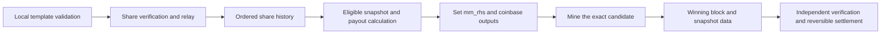

# Replicated mining pools on Knots: feasibility and protocol draft

Status: design only, with a separate synthetic commitment experiment. No mining
network, payout system, new RPC, or consensus change is implemented by this draft.

Base: `bitcoinknots/bitcoin`, tag `v29.4.1.knots20260508`, commit
`8c85b1585dac23f964e2dd32045624de7f02aa58`. Local branch:
`sharepool/design-prototype`. This checkout has not been published as a GitHub fork.

## Feasibility

Yes. Nodes can exchange templates and miner shares, independently validate them,
replicate accounting state, and mine a commitment to that state. This resembles
[P2Pool](https://github.com/p2pool/p2pool), adapted to this release's PoW and header.
It requires a separate share protocol; ordinary block and transaction propagation
does not provide agreement about pool accounting.

This exact tag uses a version-2 BLAKE2b header at its configured activation.
`src/primitives/block.h` serializes the 256-bit `m_mm_rhs` field.
`CBlockHeader::GetHash()` in `src/primitives/block.cpp` includes that field in the
tagged merge-mining hook before calculating PoW. This is a usable commitment
location, not a sidechain database or an existing pool-settlement protocol.
Compatibility here means compatibility with this exact Knots chain and its rules;
it does not imply compatibility with SHA256d-only software or miners.

## Correct the timing

The settlement root must be fixed **before** miners hash a job. Replacing it after
finding a block changes the hash; the old solution provides no assurance that the
modified block meets the target. Coinbase payouts must also be fixed before mining.

There are two coherent interpretations of a round:

1. Mine a snapshot of already eligible shares. A winning block settles that
   particular snapshot. Shares outside it follow the specified future eligibility
   rules; they cannot be inserted retroactively into the winning job.
2. Close a round when a block is found, reconcile it under explicit ordering rules,
   and commit the resulting settlement in a **later** block. Payments must then
   use a separately defined delayed-payment mechanism.

The first interpretation is the working assumption for this draft. It does not
promise to include every share submitted anywhere before the block was found.
No peer can establish that a privately withheld share does not exist.

The winning share itself cannot be an ordinary leaf in the root its own PoW
commits to: that would introduce a circular dependency. Use a predecessor state,
with any finder reward specified in the candidate coinbase before mining, or
credit the winning contribution through a later, explicitly defined transition.

## Proposed participant flow

Start with an **opt-in overlay** whose participants run validating Knots nodes.
Use a separate peer service and an explicit pool namespace. Pool participation,
template selection, and relay policy are local choices. Base-chain block validity
continues to follow the upstream rules.

Templates advertise a content identifier and enough retrievable transaction and
coinbase data for local validation against the referenced chain state. Template
identity must define permitted nonce, extranonce, and time mutations precisely.
The upstream `getblocktemplate` implementation requires clients to declare
`blake2b` support when applicable; this is not a drop-in SHA256 Stratum integration.

Each share must bind the protocol version, base-chain identity, pool identity,
previous main block, preceding share state, template, payout destination, and
protocol-approved target **in the mined commitment**. An attached miner name or
signature alone cannot prevent relabeling work. Define which fields are committed
before mining and which are derived afterward to avoid another self-reference.

Before acceptance, a node verifies the share's encoding and resource bounds,
permitted target and credited work, actual PoW, predecessor references, template
and transaction validity, payout commitment, attribution, and duplicate identity.
Weight accounting by verified work, not the number of connections, pool names, or
arbitrarily easy shares. Miner submissions at low local difficulty need not all be
global accounting shares; a higher protocol difficulty can bound network load.

## Agreement and multiple pools

Gossip does not guarantee equal local inventories. Sorting each node's received
shares only creates the same root when their input sets already match.

A candidate approach is a sharechain with cumulative-work fork choice and a
deterministic tie-break. A production specification must still define difficulty
adjustment, predecessor validity, stale-share eligibility, scoring windows, and
behavior during partitions. These rules are not settled by this draft.

If each independent pool keeps its own sharechain, aggregate a canonical list of
`(pool_id, eligible_tip, accounting_root)` entries. The aggregator still needs rules
for which pools and tips are eligible and how work across them is counted. A
Merkle tree over independently advertised roots does not solve that problem.
A single shared accounting sharechain is a simpler first implementation.

Each job names an immutable predecessor snapshot. Record eligible shares in a
canonical format and order, reject duplicates, distinguish leaf and internal
hash domains, bind the item count, and bind network, pool, round, and ruleset in
the enclosing commitment. Specify hash byte order when mapping it to `m_mm_rhs`.
If other merge-mined applications also use this field, define a namespaced
aggregation format rather than overwriting their commitments.

On receipt of a winning block, peers obtain its referenced data and validate that
snapshot, not equality with their current inventories. Missing data means the
overlay state is pending verification. A Merkle proof establishes inclusion;
it does not establish share validity, completeness, or data availability.

## Payment and settlement

For a first implementation, calculate direct coinbase outputs from eligible work.
Participants verify the exact reward allocation before contributing work. Define
fees, payout rounding, dust handling, finder reward, and payout-output limits.
Direct coinbase outputs pay the included recipients if the block remains in the
chain, subject to coinbase maturity. They do not make upstream nodes enforce the
pool's fairness rules.

A Merkle root of account balances alone does not transfer coins or allow claims.
If settlement means balances instead of direct outputs, custody and withdrawals
require an additional explicit design.

Persist verified shares, templates or retrievable references, snapshot records,
block associations, and state-transition undo records. Closing a round must be
atomic and idempotent. Parent-chain and sharechain reorganizations must undo
affected accounting. Do not treat the first block announcement as irreversible
finality. Retention and pruning must preserve whatever historical validation a
new participant is expected to perform.

## This release's hidden XOR key

`src/primitives/block.cpp` describes a pooling miner knowing only a commitment to
`m_xor_key` until a block is found. The final hash also depends on the mask derived
from that key. Publishing full headers containing the key to all peers makes the
key public and gives up that concealment's anti-withholding property.

A simple public-validation prototype can use a zero/public key. Preserving the
hidden-key property needs a dedicated public partial-work verifier and a defined
key-holder trust model, or further cryptographic design. Do not claim ordinary
full-header validation preserves the secret-key protection. The accompanying
experiment uses a zero key and does not implement such a verifier.

## Optional overlay versus mandatory chain rules

For an optional overlay, miners may decline a job or peer based on their local
checks. A base-chain-valid block remains valid even when its pool data is missing
or disagrees with a participant's preferred share history.

Requiring every chain block to include a correct pool settlement introduces new
consensus rules. All enforcing nodes, not only miners, need deterministic checks,
an activation mechanism, and a way to obtain every required validation input.
Never use local arrival order, local peer votes, or a missing local share as a
permanent block-invalidity rule. Unilateral deployment can split the chain.
Adding a restriction is not automatically a hard fork relative to this tag;
classification depends on the final rules and compatibility.

The user-facing enforcement choice remains open. The local branch intentionally
does not choose or activate new chain validity rules.

## Implementation boundary and next work

Current artifacts are this draft and `contrib/sharepool/precommit_demo.py`, a
synthetic experiment using the upstream Python header hashing implementation.
The experiment does not validate real miner shares, run `bitcoind`, exchange data,
persist rounds, pay miners, or demonstrate acceptance by a live or regtest chain.

After choosing the enforcement model and settlement semantics, specify and test
the share-state machine before integrating peer transport and mining jobs.
Relevant integration points are `src/node/miner.cpp`, `src/rpc/mining.cpp`, the
mining interfaces, and an isolated share-state store. Base-chain validation should
only change if mandatory enforcement is selected.

Required integration scenarios include delayed shares, duplicate/replayed work,
invalid templates, false payout attribution, unavailable snapshots, two winners,
peer partitions, sharechain and main-chain reorganizations, crash recovery,
bounded storage, and interoperability with unchanged nodes in overlay mode.
